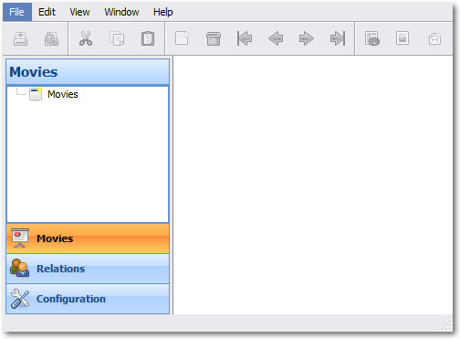

¿Por qué Python en una startup?
===============================

---

Ventajas
========

---

# Open Source

.notes: [http://www.startuplessonslearned.com/2008/09/lean-startup.html](www.startuplessonslearned.com/2008/09/lean-startup.html)

# Presenter Notes

- GPL compatible
- Eric Ries: Lean startups can operate with much less waste.

---

# Cross OS

# Presenter Notes

- No sabemos quien es el cliente, podemos cambiar de plataforma sin hacer nada

---

# Multiplataforma

# Presenter Notes

- web, escritorio, móvil, embebido
- No sabemos quien es el cliente, podemos cambiar de plataforma sin hacer nada

---

# Prototipado rápido

.notes: [http://www.python-camelot.com/](www.python-camelot.com)

# Presenter Notes

- Frameworks de prototipado rápido (eg. python-camelot)
- Testear con usuarios interfaces

---

# Muchas bibliotecas

.notes: **19771 packages en pypi**

# Presenter Notes

- Beneficios de pip y easy_install
- No repetir código, probar y cambiar

---

Mitos
=====

---

# Pocos python-developers

# Presenter Notes

- No se necesitan python-developers se necesitan developers
- Startups más resilientes a cambios de desarrolladores

---

# Ruby (Rails) es más cool

# Presenter Notes
  
- Más que ruby, Ruby está estancado
- Python 9 actualmente, Ruby 13. Ruby 2007, python 2010 y 2007 (tiobe)

---

# Hosting sólo para php

- Startups no usan hostings tradicionales
- Se necesita elasticidad si o si

---

# ¡Gracias!

.qr: 450|http://pedroburon.info/pqpythonstartup

[https://github.com/pedroburon/pqpythonstartup](github.com/pedroburon/pqpythonstartup)

[http://witoi.com](witoi.com)

---

# Presentación realizada con **landslide**

[https://github.com/adamzap/landslide](github.com/adamzap/landslide)

Para instalar 

    pip install landslide

.notes: **Aplicación hecha en python**
