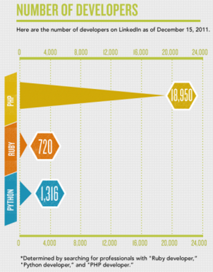
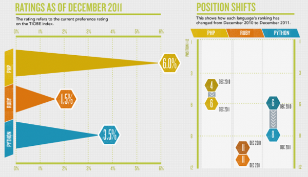
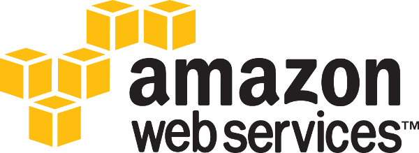

¿Por qué python en una startup?
===============================

---

Ventajas
========

---

# Open Source

# Presenter Notes

- GPL compatible

---

# Cross OS

---

# Multiplataforma

# Presenter Notes

- web, escritorio, móvil, embebido

---

# Muchas bibliotecas

.notes: **19771 packages en pypi**

# Presenter Notes

- Beneficios de pip y easy_install

---

Mitos
=====

---

# Pocos python-developers

# Presenter Notes

- No se necesitan python-developers se necesitan developers
- Startups más resilientes a cambios de desarrolladores

---

# Ruby (Rails) es más cool

# Presenter Notes
  
- Más que ruby
- Ruby está estancado

---

# Hosting sólo para php

---

# ¡Gracias!

.qr: 450|http://pedroburon.info/pqpythonstartup

[https://github.com/pedroburon/pqpythonstartup](https://github.com/pedroburon/pqpythonstartup)

[http://witoi.com](http://witoi.com)

---

# Presentación realizada con **landslide**

[https://github.com/adamzap/landslide](https://github.com/adamzap/landslide)

Para instalar 

    pip install landslide

.notes: **Aplicación hecha en python**
