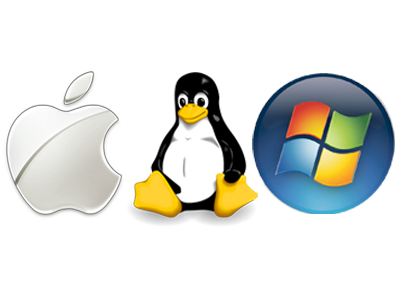

¿Por qué python en una startup?
===============================

---

Ventajas
========

---

# Open Source

# Presenter Notes

- GPL compatible

---

# Cross OS

---

# Multiplataform

# Presenter Notes

- web, escritorio, móvil, embebido

---

Mitos
=====

---

# Pocos python-developers

# Presenter Notes

- No se necesitan python-developers se necesitan developers
- Startups más resilientes a cambios de desarrolladores

---

# Ruby (Rails) es más cool

# Presenter Notes
  
- Más que ruby
- Ruby está estancado

---

# Hosting sólo para php

